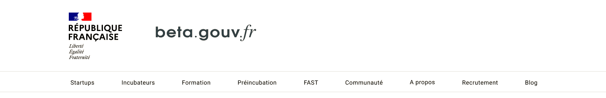

# La marque de l'État

## Le bloc-marque

Le bloc-marque permet aux usages de reconnaître un site en lien officiel avec le gouvernement.

Il est composé d'une Marianne, d'un intitulé officiel, de la devise française et parfois complété de logos.

### Intitulé du bloc-marque 

La structure du bloc-marque varie selon le site sur lequel il se situe. Dans le cadre des start-ups d’état, on peut retrouver ces cas d’usages :

| La SE est pilotée par… | Alors, l 'intitulé du bloc-marque est… |
| :--- | :--- |
| un ministère | au nom de ce ministère |
| plusieurs ministères | « Gouvernement » |
| une entité interministérielle | « Gouvernement » |
| un opérateur public | « République Française » |
| une entité servicielle | « République Française » |


En savoir plus : [Les émétteurs de l’état](https://www.gouvernement.fr/charte/charte-graphique-les-fondamentaux/l-architecture-de-marque-de-l-etat#-Les-%C3%A9metteurs-de-l%E2%80%99%C3%89tat)


### Les logos du site

Dans le contexte des start-ups d’état, souvent en lien vers des usagers, le bloc-marque peut être accompagné d’un ou plusieurs logo : celui de la SE, mais aussi celui de l’opérateur publics ou de l’entité servicielle.

| La SE est pilotée par… | Alors, on trouvera en 2… | En 3… | En 4… |
| :--- | :--- | :--- | :--- |
| un ou plusieurs ministères | le logo ou le nom de la SE | celui des partenaires | - |
| un opérateur public | le logo ou le nom de la SE | le logo de l’opérateur | - |
| plusieurs émétteurs | le logo de la SE | celui de l’opérateur pilote | celui des co-émétteurs et des autres partenaires |


En savoir plus :

* [Le principe du bloc-marque](https://www.gouvernement.fr/charte/charte-graphique-les-fondamentaux/le-bloc-marque)
* [Le système graphique de la marque de l’État](https://www.gouvernement.fr/charte/charte-graphique-les-fondamentaux/le-systeme-graphique)
* [L’architecture de la marque de l’État](https://www.gouvernement.fr/charte/charte-graphique-les-fondamentaux/l-architecture-de-marque-de-l-etat)


### Emplacement du bloc 

Le bloc-marque sera situé en-tête ou dans le footer selon les cas :

| La SE est portée par… | Alors, le bloc-marque est situé… |
| :--- | :--- |
| Un ministère | en entête du site |
| Une entité ministérielle | en entête du site |
| Des individus \(députés…\) | Dans le footer du site |

Dans le cas où le bloc-marque est en pied de page de site, il peut être accompagné d’une légende :


En savoir plus : [Les règles d’usage de l’architecture de la marque de l’État](https://www.gouvernement.fr/charte/charte-graphique-les-fondamentaux/l-architecture-de-marque-de-l-etat)


## Règles de design UI 

### Les dimensions 

L’intégration du bloc-marque sur le web _Desktop_ doit respecter certaines règles.

Les marges entre le bloc-marque et le nom du site sont de :

* **80 px** si le nom du site est le nom de la SE ;
* **40 px** si la SE a un logo.

Les marges entre le bloc-marque et le reste du contenu :

* **30px** au dessus et en dessous.

L’entête \(le bloc marque-état et le nom du site\) doit respecter certaines dimensions :

* L’ensemble ne doit pas dépasser 5 colonnes sur un système de 12 grilles.
* La hauteur du nom du site \(ou de son logo\) maximale est celle du bloc-marque. Le nom du site sera centré dans la hauteur.


En savoir plus : [UI Kit des applications](https://www.gouvernement.fr/charte/charte-graphique-les-applications/ministeres-secretariats-d-etat-services-deconcentres-ou-a-l)


### Le fond 

Le bloc-marque est posé en priorité en couleur sur fond blanc. Sur un fond coloré, il est intégré au sein d’un cartouche blanc.


En savoir plus : [Les usages sur fond du bloc-marque](https://www.gouvernement.fr/charte/charte-graphique-les-fondamentaux/le-bloc-marque#Les-usages-sur-fond)


### Le responsive 


Actuellement, le cas n’a pas été décrit dans la charte officielle.


Plusieurs SE sont en contact avec le SIG pour trouver un compromis permettant de garantir l’officialité d’un site tout en prenant en compte les petites surfaces telles que les sites sur mobile.

### La typographie

La typographie Marianne est uniquement dédiée au print et n'est pas destinée au web.


La typographie pour le web est encore en cours de développement. Calendrier prévu pour septembre 2020.


## Exemples d’applications 

⭕️ A compléter.

