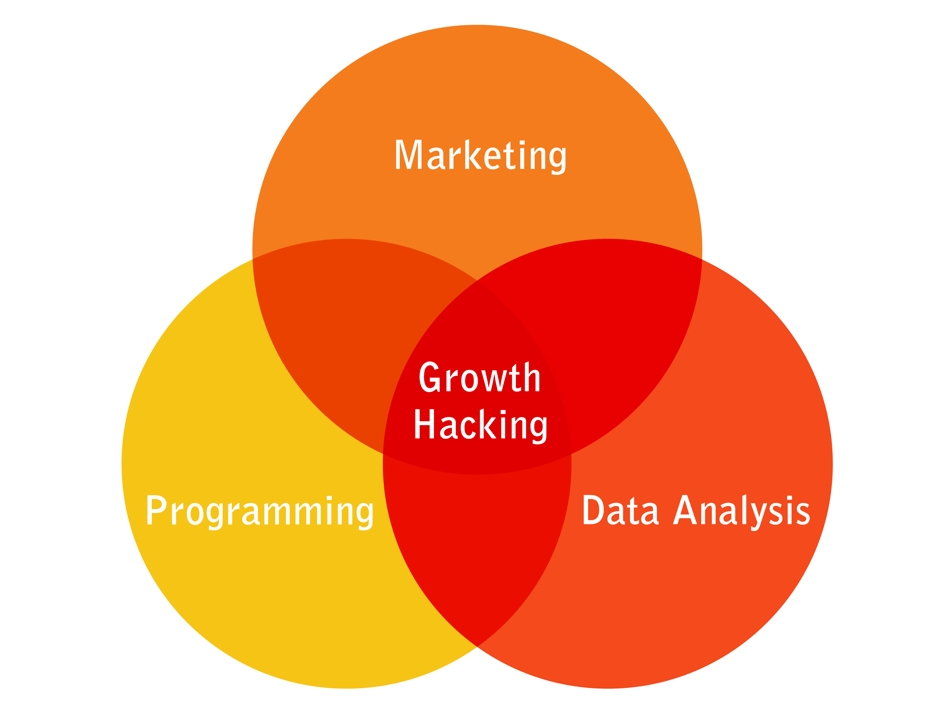

# 🚀 Les principe du Growth-Hacking

Si vous souhaitez de l'aide sur les sujets liés à la croissance, la DINUM met en place un accompagnement en transverse : [https://doc.incubateur.net/communaute/aide-transverse/growth-hacking-acquisition](https://doc.incubateur.net/communaute/aide-transverse/growth-hacking-acquisition) par Chaïb Martinez

Le Growth Hacking permet de s'attaquer aux freins qui bloquent la  croissance organique de la SE, et donc l'augmentation de son impact:

* trop peu de personnes connaissent le service proposé 
* trop peu personnes s'inscrive puis utilise  le service
* trop peu de personnes utilise régulièrement le service
* trop peu de personnes deviennent ambassadrices du service. 

Au final, l'impact est faible. 

### Présentation du Growth Hacking



[Les slides](https://www.evernote.com/l/AsnMrUNsw3VNcLkMRXKuiX6eRZFg7L3eLrE)

Le growth hacking recouvre toutes les tactiques d'acquisition, de conversion \(activation\), de rétention \(fidélisation\) d'utilisateurs d'une startup. Ils participent à augmenter l'impact d'un produit.

C'est un mélange de marketing \(souvent digital\), d'ingénierie informatique, et d'analyse de données  

